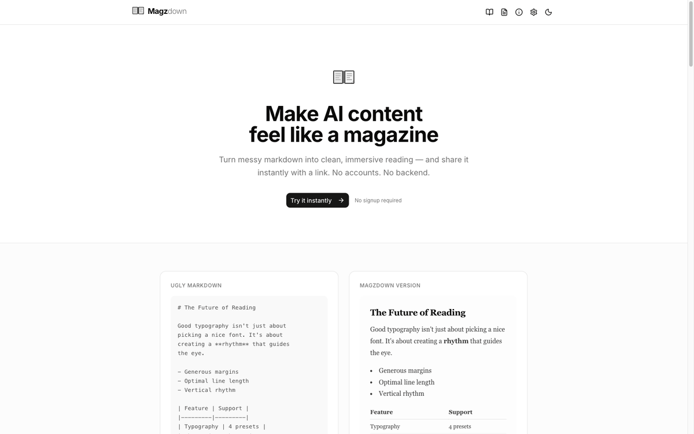

# Magzdown agent tools

Your agent writes a report. Instead of dumping markdown in the chat, it hands you a link that opens as a typeset, paginated document. This repo has three ways to teach an agent that: a Claude Code skill, a Cursor rule, and an MCP server.



## Install

### Claude Code skill

```bash
git clone https://github.com/xarl3z/magzdown-agent-tools
mkdir -p ~/.claude/skills
cp -r magzdown-agent-tools/skills/magzdown ~/.claude/skills/magzdown
```

Per project instead: copy to `.claude/skills/magzdown/` inside the repo. Then ask Claude to "open this in magzdown" or "make this report readable".

### Cursor rule

```bash
mkdir -p .cursor/rules
cp magzdown-agent-tools/cursor/magzdown.mdc .cursor/rules/
```

The rule is `alwaysApply: false`; Cursor picks it up from its description when you ask to share or present a document.

### MCP server

```bash
cd magzdown-agent-tools/mcp
npm install && npm run build
claude mcp add magzdown -- node "$PWD/dist/index.js"
```

Cursor and Claude Desktop config is in [mcp/README.md](mcp/README.md). The tool is `open_in_magzdown({ markdown, title? })` and returns the link. Set `MAGZDOWN_AUTO_OPEN=1` to also open it in your browser.

## How the URL works

The markdown is the URL. Two bytes (`0x01 0x00`) go in front of the UTF-8 text, the payload is base64-encoded, made URL-safe (`+` to `-`, `/` to `_`, padding stripped) and placed after `https://www.magzdown.com/open?md=`. The reader decodes it in the browser; nothing is uploaded and no account is needed. Keep documents under about 100 KB or the URL may get truncated. The full spec with a test vector is in [shared/encode.md](shared/encode.md) and at https://www.magzdown.com/docs.

## Links

- Docs: https://www.magzdown.com/docs
- Pricing: https://www.magzdown.com/pricing

## License

MIT. Not affiliated with Anthropic, OpenAI or Cursor.
